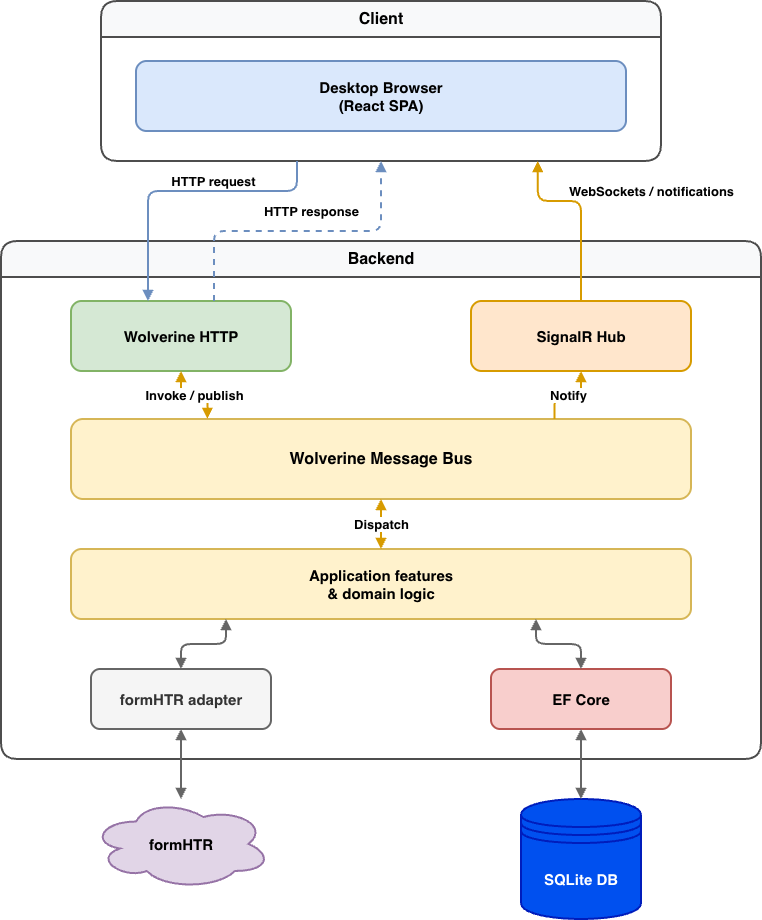
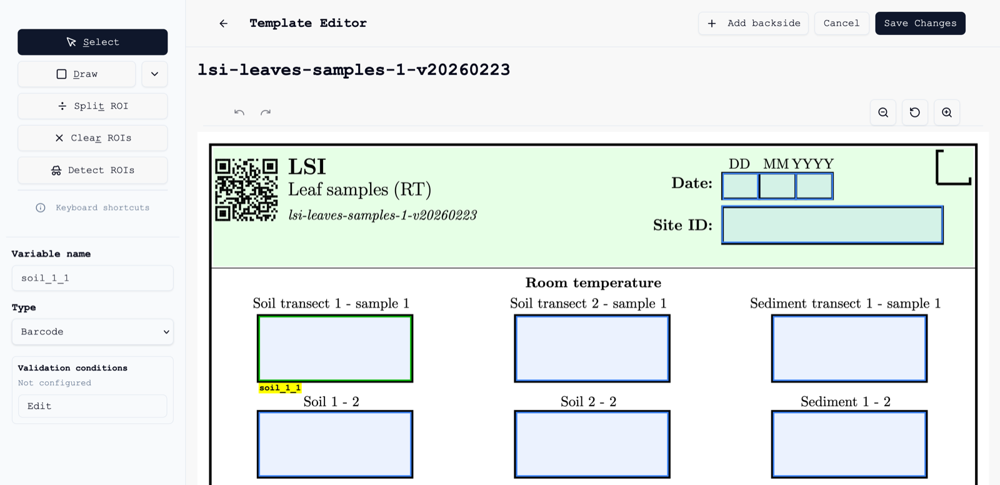
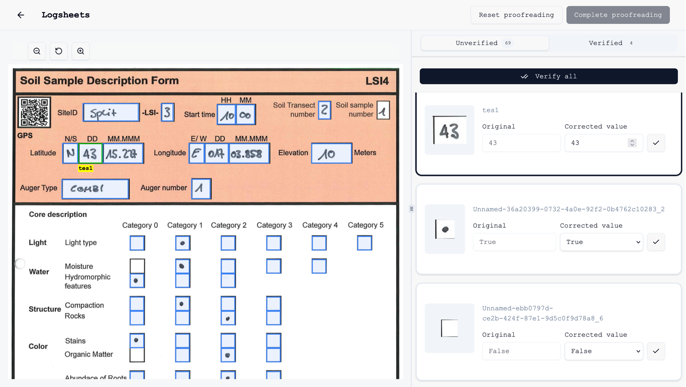

# Summary

Field research often relies on paper logsheets that are durable in harsh environments but cumbersome to digitize afterward.
The open-source Python tool formHTR [@formHTR_repo] automates extraction of handwritten values from scanned forms using template-defined regions of interest (ROIs) and external optical character recognition (OCR) services, but its command-line workflow is difficult for non-technical domain experts.
LogsheetXtractor is a full-stack web application that wraps formHTR in a browser-based workflow for template management, logsheet upload, alignment, OCR processing, proofreading, and export to spreadsheet formats.
The software targets research teams—initially motivated by coastal biodiversity fieldwork on the TRaversing European Coastlines (TREC) expedition [@embl_trec]—who need to move from paper capture to structured digital data without maintaining local Python environments or juggling separate tools for verification.

# Statement of need

Paper-based data collection remains practical where power, connectivity, or training constraints rule out digital devices in the field [@walther11].
Once scans are available, however, manual transcription and error-prone spreadsheet proofreading become bottlenecks.
formHTR addresses the technical extraction step: users define ROIs on a PDF template, align each scanned logsheet, and run OCR through providers such as Amazon Textract, Google Cloud Vision, or Azure AI Vision [@aws_textract; @google_vision; @azure_vision].
The output is a flat spreadsheet that must be checked against the original scan without built-in spatial context.

The primary users are scientific staff and volunteers—not software engineers—who should not need to install Python, manage virtual environments, distribute API credential files across laptops, or memorize CLI invocations.

# State of the field

Several ecosystems address parts of the handwritten-form digitization problem, but none fully match the combined requirements of template versioning, multi-provider OCR orchestration, and integrated proofreading for irregular field scans.

**formHTR** [@formHTR_repo] is the direct predecessor and extraction engine.
It is mature for batch processing and offers desktop GUIs for ROI selection, yet configuration remains file-based, processing is script-driven, and verification happens outside the tool in Excel.
Contributing only to formHTR would not deliver a shared web deployment, real-time processing notifications, or the linked proofreading workspace described below.

**General OCR and document-AI services** (cloud APIs above, or document understanding platforms) return unstructured text or generic key-value pairs.
They do not manage template libraries, logsheet lifecycle states, ROI semantics (numeric fields, checkboxes, barcodes), or domain-specific validation such as geographic coordinate bounds [@metaTREC_curation].

**Electronic data capture (EDC) and mobile form apps** replace paper at collection time.
They are ill-suited when waterproof paper, offline field conditions, or expedition logistics require physical sheets first.

**Spreadsheet-centric workflows** remain the de facto verification path for many labs but amplify context switching between PDF viewers and tables, which user testing linked to missed OCR corrections (see Research impact statement).

LogsheetXtractor was built as a **web orchestration layer** on top of formHTR because the research community already depended on the Python extraction pipeline, while the missing capability was an accessible, deployable interface—not a second OCR implementation.
Upstream changes were contributed to formHTR (e.g., headless ROI detection and web-oriented CLI options) so the CLI and web tool stay aligned [@formHTR_pr81].

# Software design

LogsheetXtractor provides a centralized deployment where administrators configure OCR credentials on the server, while researchers interact through a visual interface.
The application preserves formHTR’s extraction logic by invoking the existing scripts in isolated processes rather than reimplementing OCR pipelines, so improvements to formHTR continue to benefit both interfaces [@formHTR_pr81].

LogsheetXtractor is a client–server application: a React frontend and an ASP.NET Core backend, packaged with Docker Compose for reproducible deployment.
The design prioritizes **process isolation** between the web server and formHTR: OCR and image processing run in separate Python subprocesses so failures or heavy workloads cannot take down the API, and dependency conflicts between .NET and Python stacks are avoided.

On the backend, **clean architecture** layers (domain, application, infrastructure, API) organize features such as templates, logsheets, ROIs, and extracted values.
**CQRS-style** commands and queries separate reads from writes; a **Wolverine** message bus dispatches handlers and domain events (for example, auto-aligning a logsheet after upload) without bloating HTTP endpoints.
Long-running OCR jobs update persisted logsheet state and notify the UI through **WebSockets**, avoiding fragile client polling.
Predictable business failures use a **Result** pattern instead of exceptions for control flow.
A **transactional outbox** ensures database updates and queued processing commands commit atomically.

Integration with formHTR uses a thin script runner and a higher-level adapter that prepares paths, credentials, and headless flags before invoking the Python CLI. \autoref{fig:architecture} shows the major components.

{ width=95% }

The frontend uses **TanStack Query** for server state, **Zod** for runtime validation of API payloads, and React context for the template editor.
The editor supports undo/redo history, keyboard shortcuts, and staged saves so frequent ROI edits are not sent on every mouse move.
**Manual alignment** overlays a semi-transparent template on the scan; users drag corners until ROIs line up with handwriting, with optional preview of misalignment.

**Proofreading** splits the view: logsheet preview with ROI highlights on the left, virtualized list of extracted values (cropped ROI thumbnails and editable fields) on the right.
Selecting an ROI in either pane scrolls and highlights the counterpart, reducing the spatial disconnect of spreadsheet-only review.
Optional **validation conditions** (type checks, numeric ranges, logical combinations) flag suspicious values before export.

Screenshot in \autoref{fig:editor} illustrates interactive template editor and in \autoref{fig:proofread} the proofreading workspace.

{ width=95% }

{ width=95% }

Automated tests span **xUnit** unit and integration suites, **Vitest** and **Playwright** on the frontend, and API end-to-end tests with a fake script engine so CI does not require live OCR credentials.
GitHub Actions runs these checks on each change.

# Research impact statement

LogsheetXtractor extends the formHTR [@formHTR_repo] pipeline used to digitize handwritten logsheets from the TRaversing European Coastlines (TREC) programme [@embl_trec] and related metaTREC curation work.
The web application was co-developed with the formHTR maintainers so that the same extraction backend serves both the existing CLI and the new interface.

**Usability evaluation:** five first-time users proofread the same logsheet twice—first with formHTR’s Excel export alongside the PDF, then with LogsheetXtractor’s side-by-side interface (seeded OCR errors in both conditions).
They corrected 76% of seeded errors on average in the spreadsheet workflow versus 100% in the application, and mean time per field fell from 10.4 s to 8.8 s (n=5).
The comparison is small and exploratory; it nevertheless supports the design goal of keeping extracted values visually tied to their ROIs during verification.

# AI usage disclosure

No generative AI tools were used to implement LogsheetXtractor’s application source code, automated tests, or formHTR integration changes.
The JOSS manuscript was drafted with assistance from a large language model (Cursor agent) using the author’s master’s thesis and existing project documentation as source material; the author reviewed, edited, and takes responsibility for all factual claims, citations, and disclosures in this paper.

# Acknowledgements

TBA

# References
